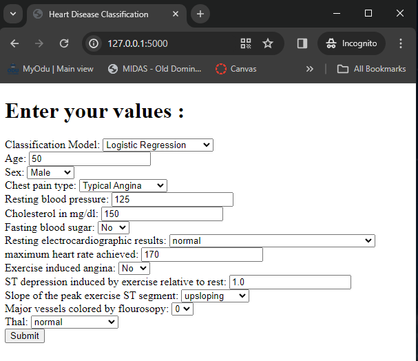
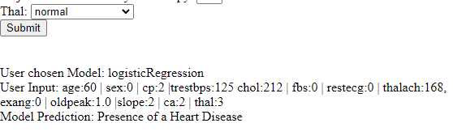
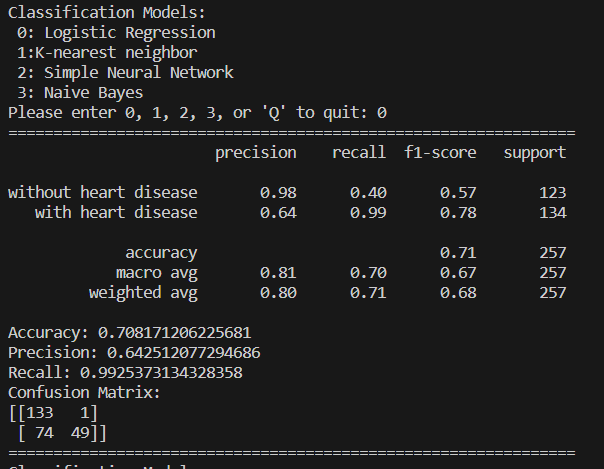

Anna Garcia

CS 723 - ODU

Dec 08, 2023

# 723 Classification Project

This is a class project that explores different binary classification models namely, Logistic Regression,
Naive Bayes, k-Nearest Neighbor, and a simple Neural Network. The project uses the Heart Disease dataset from [Kaggle](https://www.kaggle.com/datasets/johnsmith88/heart-disease-dataset). The project can be ran two ways: as a web application and locally.
The web application (appy.py) that runs locally, which allows the user to input their own data, while metrics.py allows user to visualize the metrics of the models.

The models are pre-trained and they are stored under `/models` and the datasets are in `/dataset`.

## Required Software
1. Python 3.11. 
> Download from [python.org](https://www.python.org/downloads/release/python-3115/) - Use Windows installer
2. Git
> Download from [git-scm.com](https://git-scm.com/downloads)
3. Visual Studio Code (optional)
> Download from [code.visualstudio.com](https://code.visualstudio.com/download)

## Setup
1. Ensure that you have python3 running in your machine. Specifically `python 3.11`
To check from command line:

```
python –-version
```
2. Make sure you have Git installed in your machine.
```
git –-version
```

3. Open your favorite commandline

4. Clone the repository:
```
git clone https://github.com/AnnaGarcia1207/723-classification-models.git
```

** If downloaded from git or Canvas, unzip the file

```
unzip 723_classification_project.zip
```


5. `cd` into the directory.
    * You can keep using the commandline from here or use VisualStudioCode

6. From the directory, check the python version you are using: `python –-version`. If you are using the latest python version - `3.12 and above`, we need to use the earlier version to download the required libraries in a python virtual environment.

** As of 12/2/2023, tensorflow library cannot be installed using pip, only python 3.9, 3.10, and 3.11.

7. Go back to the command line. From the directory, download python virtualenv
```
py -3.11 -m pip install virtualenv
```
8. Create a virtual environment, here I named it “venv”
```
py -3.11 -m virtualenv venv
```

9. You should see 'venv/' folder get created. We need to activate this virtual environment, so all of out libraries is contained within the `venv/` folder.
```
./venv/Scripts/activate
```

10. You should see `(venv)` in the commandline- meaning it was successfully activated.

11. Install packages:
	```
    pip install -r requirements.txt
    ```
	If this does not work please type:
    ```
    pip install tensorflow, pandas, scikit-learn, flask
    ```

## To Re-trained the model (not required, but available)
This is not required because all models are pre-trained and saved using the pickle library. The pre-trained models are in `models/` and the datasets are located in `dataset/`. If you are missing the models under `models/` then please run the command below:

```
mkdir models -- if missing directory

python trained_models.py
```

This will run the replaced the saved models and replaced with newly ran models. It will get saved in the same location.


## Running the program

Now that your environment is setup, you can explore the models two different ways. There is a Flask web application (appy.py) and a simple python script (metrics.py). 


### How to run Flask web application locally (app.py)

12. To run the web application locally : 
```
flask run
```
or 
```
python app.py
```
This will run in your localhost: http://127.0.0.1:5000/ – copy&paste in your browser. 
You should see an output:



After hitting submit you should see result output below:




13. To close the program simple pres `Ctrl+c` and deactivate the `venv` virtual environment
```
deactivate
```

### How to run Metrics script locally (metrics.py)

12. To run `metrics.py` to get the baseline metrics of each models type:
```
python metrics.py
```

13. User will be prompted for input. User can input `0, 1, 2, 3, and Q`

The corresponding input is as follows:
```
0: Logistic Regression
1: K-nearest neighbor
2: Simple Neural Network
3: Naive Bayes
Q: Quit the program
```

14. A sample output if user input `0`:


15. To quit press `Q` and deactivate the `venv` virtual environment.
```
deactivate
```
-------
